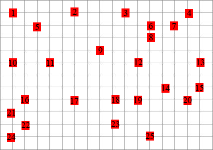

# Programmeertheorie

 ## Chips & Circuits

 Chips en circuits is een optimalisatie probleem.
 Er zijn 9 verschillende 'puzzels', van varierende moeilijkheidsgraad, maar het principe komt bij allemaal op hetzelfde neer.

 Je hebt een 'chip' in de vorm van een rooster in een ruitjespatroon, waarop 'gates' zijn geplaatst.
 Om de gates van elkaar te onderscheiden, zijn ze genummerd.
 Er zijn in totaal 3 verschillende chips voor dit probleem aan ons opgeleverd.
 Bij elke chip, worden eveneens 3 'netlists' gegeven.
 Een netlist is een lijst die opsomt welke gates met elkaar verbonden moeten worden om de chip werkend te krijgen.
 Het doel is om alle gates die volgens de netlist verbonden moeten worden, te verbinden.

 

 Hier zitten wel wat randvoorwaarden aan verbonden, die het ingewikkeld maken.
 Zo zitten er kosten verbonden aan het maken van een chip.
 De draden waarmee de gates verbonden moeten worden, kosten geld, dus hoe meer draad je nodig hebt, hoe hoger te kosten.
 Per lengte eenheid, gelijk aan de afstand tussen twee kruispunten in het rooster, zijn de kosten van een draad 1.

 Deze draden mogen elkaar wel kruisen, maar niet overlappen, want dat zou kortsluiting geven.
 Dit houdt in dat bij een kruispunt in het rooster er twee draden mogen zijn die allebei van een andere kant komen en die allebei ook weer een andere richting op gaan.
 Om kortsluiting op een kruispunt van draden te voorkomen, moeten deze op een speciale manier gemaakt worden.
 De kosten van het leggen van meerdere draden op een kruispunt is 300.

 Naast het verbinden van alle gates, geeft het probleem de extra uitdaging om de kosten van de chip te minimaliseren.

 ## Algoritmen

 #### Sort
 Dit is niet echt een algoritme, maar eerder een heuristiek.
 We hebben verschillende functies geschreven die de volgorde van de nets ten opzichte van de inputfile aanpassen.
 Deze functies moeten worden gerund voor een oplossing algoritme wordt gerund.
 De opties zijn:
 - de nets waarbij de start- en eind-gate het dichtst bij elkaar liggen, vooraan te zetten,
 - de nets waarbij de start- en eind-gate het verst van elkaar af liggen, vooraan te zetten,
 - de nets waarbij de start- en eind-gate het dichtst bij de rand van de grid liggen, vooraan zetten,
 - de nets waarbij de start- en eind-gate het dichtst bij het centrum van de grid liggen, vooraan zetten.

 #### Random
 Het eerste algoritme dat we hebben gemaakt is een random algoritme.
 Dit algoritme gaat de nets die gelegd moeten worden in de volgorde waarin ze in de grid staan af.
 Voor een net begint hij bij de start-gate, de eerste gate die gegeven is in de grid.
 Vanaf daar gaat het algoritme kijken welke kanten het nog op kan binnen de restricties van het probleem.
 Uit de richtingen die het op kan, kiest het een random richting en herhaalt dan de eerdere stappen weer.
 Na elke stap kijkt hij of hij op de eind-gate is beland.
 Als hij bij de eind-gate is, stopt hij met verder lopen en gaat hij naar de volgende gate.
 Mocht het zo zijn dat het algoritme ergens is gekomen vanaf waar het niet verder kan, dat stopt het en delete hij het hele gelegde pad.

 #### Steered random
 Als eerste verbetering op random, waren we nieuwschierig naar hoe veel het zou schelen als het algoritme zou proberen de juiste richting op te lopen.
 In dit geval begint het algoritme weer bij de start-gate.
 Vanaf hier kijkt het algoritme welke richtingen het nog op zou moeten lopen om bij de eind-gate te komen.
 Deze richtingen vergelijkt hij met de richtingen die beschikbaar zijn om vanaf dit punt te bewandelen.
 Als hier overlap in zit, geeft het algoritme de voorkeur aan omlaag gaan, mocht dat niet nodig zijn, kiest het een random richting uit de goede richtingen.
 Hierbij checkt hij nog wel even snel of deze richtingen niet een doodlopend eind zouden zijn.
 Mocht het niet lukken om de 'goede' kant op te lopen, dan gaat de voorkeur uit naar omhoog gaan.
 Mocht zelfs dat niet lukken, dan pas kiest het algoritme zelf een random richting die hij nog wel op kan vanuit dit punt.
 Bij elk punt worden deze zelfde keuzes gemaakt tot hij bij het einde is.
 Mocht hij eerder een doodlopend eind tegen komen dan de eind-gate, dan verwijdert hij de gelopen route en gaat hij verder met de volgende netlist.

 #### A*
 Bij het A* algoritme worden punten in het grid beoordeeld op basis van een kostenfunctie.
 Deze functie is de som van kosten om van de start-gate naar het beschouwde punt te komen en de minimale kosten om de eind-gate te bereiken.
 Hierbij heeft een eenheid draadlengte (de afstand tussen twee aangelegen punten) een kosten van 1 en een kruispunt (tussen twee draden) kost 300 (dit is in overeenstemming met de kostenfunctie die geminimaliseerd moet worden).
 Het algoritme begint bij de start-gate en beschouwt alle aangrenzende punten. Vervolgens kiest het algoritme het punt met de laagste functiewaarde en vergelijkt dan de buren van dit nieuwe punt en alle nog niet beschouwde voorgaande punten.
 Opnieuw kiest het algoritme het punt met de laagste functiewaarde.
 Dit process herhaalt zich tot de eind-gate gevonden is.
 Ten slotte wordt het pad tussen de start- en eind-gate gereconstrueerd.

 #### Hillclimber
 Dit algoritme heeft als input al een valide oplossing nodig.
 Het doel van dit algoritme is om deze oplossing dan te proberen te optimaliseren.
 Het algoritme kiest een random net uit de oplossing, slaat deze lokaal op, en verwijdert deze route van uit de grid.
 Daarna probeert hij met het A* algoritme dit pad opnieuw te leggen.
 Als het lukt om dit pad opnieuw te leggen voor lagere kosten, laat hij het nieuwe pad staan, anders wordt het oude pad terug geplaatst.
 Het algoritme blijft telkens random nieuwe nets hiervoor uitkiezen, tot het 1500 keer niet lukt om de kosten lager te krijgen.

 ## Reproductie resultaten
 Door het runnen van de main file, kunnen alle algoritmen via een 'interface' in de terminal gerund worden.
 We hebben zelf verschillende opties geprobeerd en deze meerdere malen met de hand gerund om de resultaten te vinden.
 Het menu is gebouwd om voor zichzelf te spreken, zodat het vinden van resultaten zo makkelijk mogelijk moet zijn.