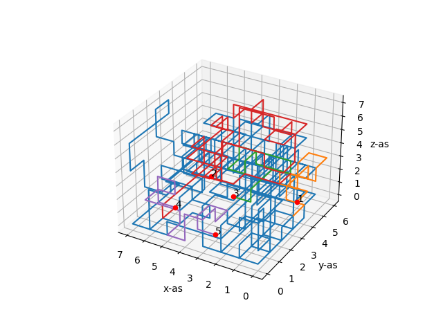

# Wetenschappenlijke analyse van het project
## Wat valt je op aan de oplossingen, hoe kun je dat verwerken in het algoritme?

### Birgit
Als je de paden random legt, kun je zelf voor de simpelste netlist vaak geen oplossing vinden.

*Example of an outcome from the random algoritm*
