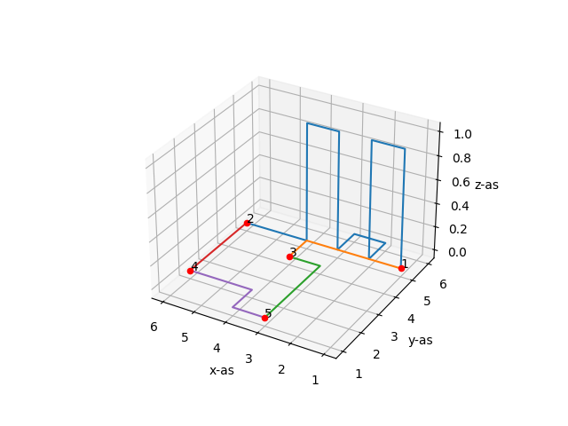
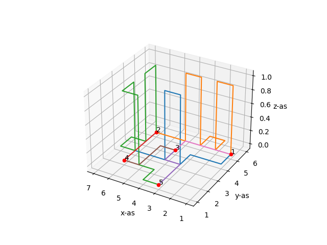

# Wetenschappenlijke analyse van het project
## Wat valt je op aan de oplossingen, hoe kun je dat verwerken in het algoritme?

###### Birgit
Als je de paden random legt, kun je zelf voor de simpelste netlist vaak geen oplossing vinden.

In bovenstaande afbeelding zie je een voorbeeld van hoe het random algoritme probeert de eerste netlist op de kleinste chip te leggen.
Hierin is 1 van de 5 netlist geslaagd gelegd.

Het viel het op dat een pad soms 'faalt' terwijl er wel een weg mogelijk is.
Om dit te ondervangen is een bepaalde herhaling in het random algoritme geïmplementeerd.
Als een net faalt, probeert hij het nog 50 keer opnieuw voordat hij het opgeeft.
Op basis hiervan krijg je oplossingen zoals hieronder.

We zien nu dat voor chip 0 en netlist 1, het random algoritme opzich relatief vaak een oplossing genereert.
Voor netlist 2 komt dit echter al bijna niet meer voor, omdat netlist 2 ingewikkelder is doordat meer paden elkaar kruisen.

Al hoewel het logisch is dat een random algoritme weinig 'goede' oplossingen genereert, waarom gaat het nou fout?
* Als je random kanten op gaat, leg je hele lange paden aan waardoor je voor andere paden minder mogelijkheden overhoudt.
* Je zou perongeluk met je pad andere gates kunnen insluiten, waardoor er voor die gates geen enkele mogelijkheid meer is.
* Met de random paden leg je ontzettend veel kruispunten, waaronder met jezelf, wat hoge kosten oplevert.

Wat kan beter?

* Probeer richting je eindgate te lopen
* Probeer de ruimte die je hebt efficient te gebruiken, de voorkeur is om zo laag mogelijk te zitten
* Leg de nets die de korste afstand moeten overbruggen eerst

Aan de hand van bovenstaande punten heb ik een 'steered random' algoritm geschreven, dat produceerde oplossingen zoals hieronder.

Nu zie je bij deze oplossing bijvoorbeeld, dat het pad nu te snel naar beneden getrokken wordt.
Het zou dus veel toegevoegde waarde hebben, als het algoritme een plek vooruit kon kijken.
Als hij toch vooruit kijkt, gaat hij ook proberen intersecties te vermijden.
Een voorbeeld van een oplossing die hij dan voor de eerste netlist genereert staat hieronder.

Netlist 2 implementeren, lukt echter vaak al niet.
Een goede oplossing:

Deze zit echter nog wel erg hoog in de kosten, door de grote hoeveelheid kruispunten.
Zo ziet een gefaalde 'oplossing' er bijvoorbeeld uit, als je het algoritme maar een poging geeft per net:
Als je kruispunten 'aan' zet

Of als je kruispunten uit zet

Dan zie je ook het random aspect in het algoritme terug, omdat het niet zo goed weet hoe het het probleem dan moet oplossen.

Wat kan er nog verbeterd worden?
* De selectie van welke nets eerst gelegd worden kan uitgebreid worden.
* Het pad 1-4 faalt vaak, omdat deze als laatst gelegd wordt en er 3 nets naar 4 gaan, het algoritme snapt niet dat het kort 'om kan lopen' en daardoor faalt het.
Dit kan beter door bv aan de start, voor elke gate en elk net, de richtingen vanaf de gates te verdelen. Dit kan echter ook een verplaatsing van hetzelfde probleem zijn.
* Hoe deal je met Fog of war principe
* Reflect op paden die er al liggen op basis van toekomst
* Test links, rechts en overheen, verwijder daarna gewoon weer, kortste wegen proberen
* Waarom gaat hij 7 plekken volledig omhoog, dan opzij en dan alle 7 weer omlaag?
* Ipv random een pad te kiezen, altijd zo veel mogelijk naar de buitenkant afwijken?
* Paden met 4 nets eerder leggen dan met minder?
