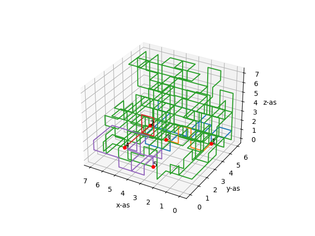
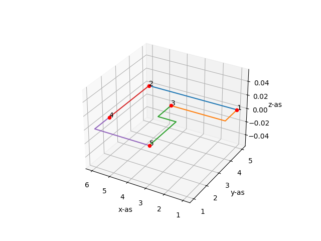
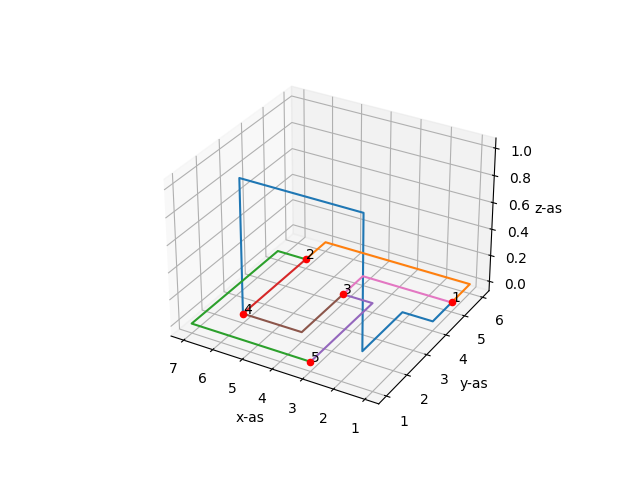
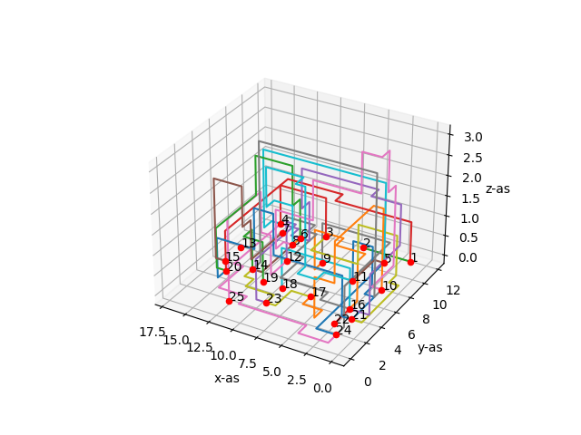
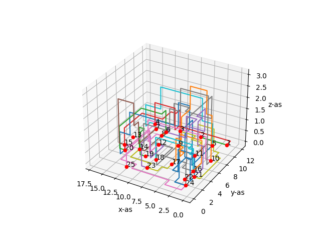
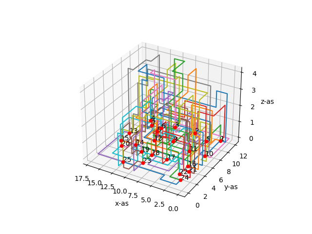
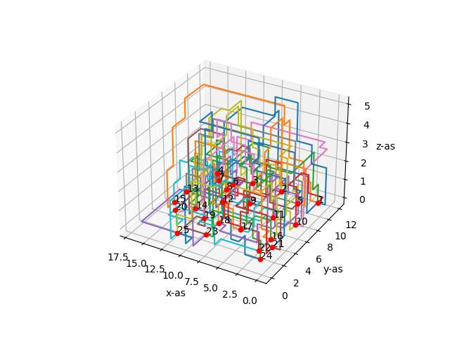
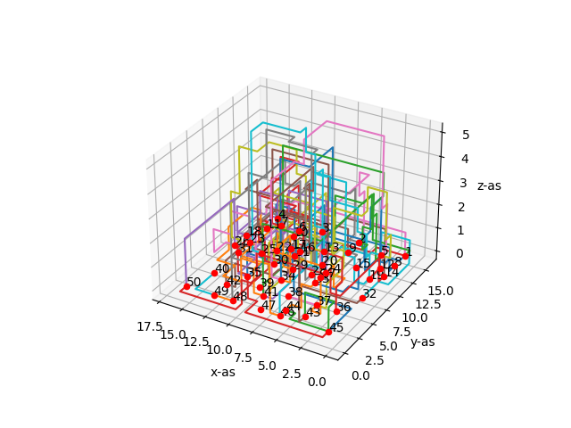
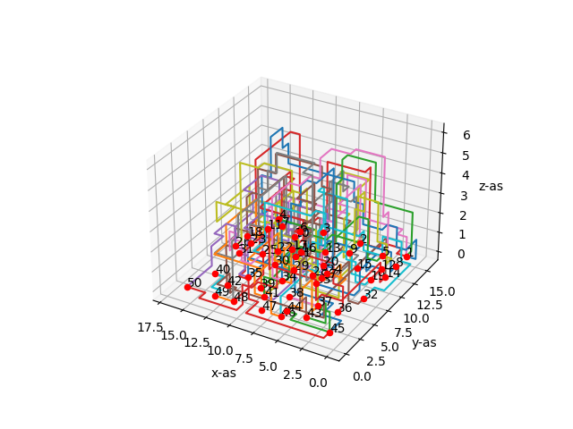

# Results Hillclimber algorithm

These results are reached until convergence was reached.
Convergence is reached if the same level of costs is found for 1500 times, is the assumption for this collection of results.
Furthermore, the A* algorithm is used for optimization.

## Optimizing random solutions

### Netlist 1
| Original costs | Original intersections | Original length | New costs | New intersections | New length |
| -------------- | ---------------------- | --------------- | --------- | ----------------- | ---------- |
| 36340          | 123                    | 440             | 20        | 0                 | 20         |

#### Original solution:

#### Optimization

### Netlist 2
| Original costs | Original intersections | Original length | New costs | New intersections | New length |
| -------------- | ---------------------- | --------------- | --------- | ----------------- | ---------- |
| 17365          | 57                     | 265             | 41        | 0                 | 41         |

#### Original solution

#### Optimization

## Optimizing A* solutions

### Netlist 1
| Original costs | Original intersections | Original length | Original height | New costs | New intersections | New length | New height |
| -------------- | ---------------------- | --------------- | --------------- | --------- | ----------------- | ---------- | ---------- |
| 22             | 0                      | 22              | 0               | 20        | 0                 | 20         | 0          |

### Netlist 2
| Original costs | Original intersections | Original length | Original height | New costs | New intersections | New length | New height |
| -------------- | ---------------------- | --------------- | --------------- | --------- | ----------------- | ---------- | ---------- |
| 43             | 0                      | 43              | 1               | 43        | 0                 | 43         | 1          |

### Netlist 3
| Original costs | Original intersections | Original length | Original height | New costs | New intersections | New length | New height |
| -------------- | ---------------------- | --------------- | --------------- | --------- | ----------------- | ---------- | ---------- |
| 72             | 0                      | 72              | 3               | 72        | 0                 | 72         | 3          |

### Netlist 4
| Original costs | Original intersections | Original length | Original height | New costs | New intersections | New length | New height |
| -------------- | ---------------------- | --------------- | --------------- | --------- | ----------------- | ---------- | ---------- |
| 3687           | 11                     | 387             | 3               | 375       | 1                 | 75         | 3          |

#### Original solution

#### Optimization

### Netlist 5
| Original costs | Original intersections | Original length | Original height | New costs | New intersections | New length | New height |
| -------------- | ---------------------- | --------------- | --------------- | --------- | ----------------- | ---------- | ---------- |
| 8291           | 26                     | 491             | 3               | 1127      | 2                 | 527        | 4          |

### Netlist 6
| Original costs | Original intersections | Original length | Original height | New costs | New intersections | New length | New height |
| -------------- | ---------------------- | --------------- | --------------- | --------- | ----------------- | ---------- | ---------- |
| 19047          | 61                     | 747             | 4               | 1979      | 4                 | 779        | 5          |

#### Original solution

#### Optimization

### Netlist 7
| Original costs | Original intersections | Original length | Original height | New costs | New intersections | New length | New height |
| -------------- | ---------------------- | --------------- | --------------- | --------- | ----------------- | ---------- | ---------- |
| 15318          | 48                     | 918             | 5               | 938       | 0                 | 938        | 6          |

### Netlist 8
| Original costs | Original intersections | Original length | Original height | New costs | New intersections | New length | New height |
| -------------- | ---------------------- | --------------- | --------------- | --------- | ----------------- | ---------- | ---------- |
| 18298          | 58                     | 898             | 5               | 3960      | 10                | 960        | 6          |

#### Original solution

#### Optimization

### Netlist 9
| Original costs | Original intersections | Original length | Original height | New costs | New intersections | New length | New height |
| -------------- | ---------------------- | --------------- | --------------- | --------- | ----------------- | ---------- | ---------- |
| 36631          | 118                    | 1231            | 6               | 7083      | 19                | 1383       | 7          |